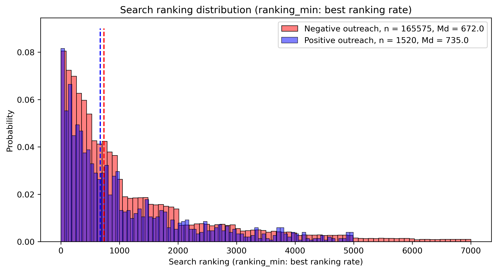
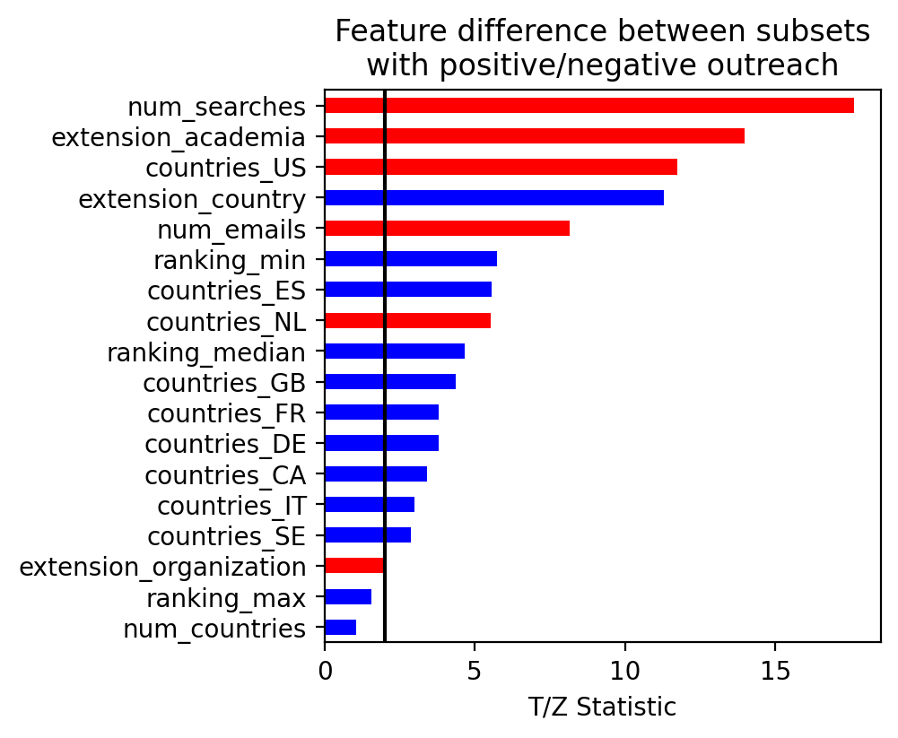
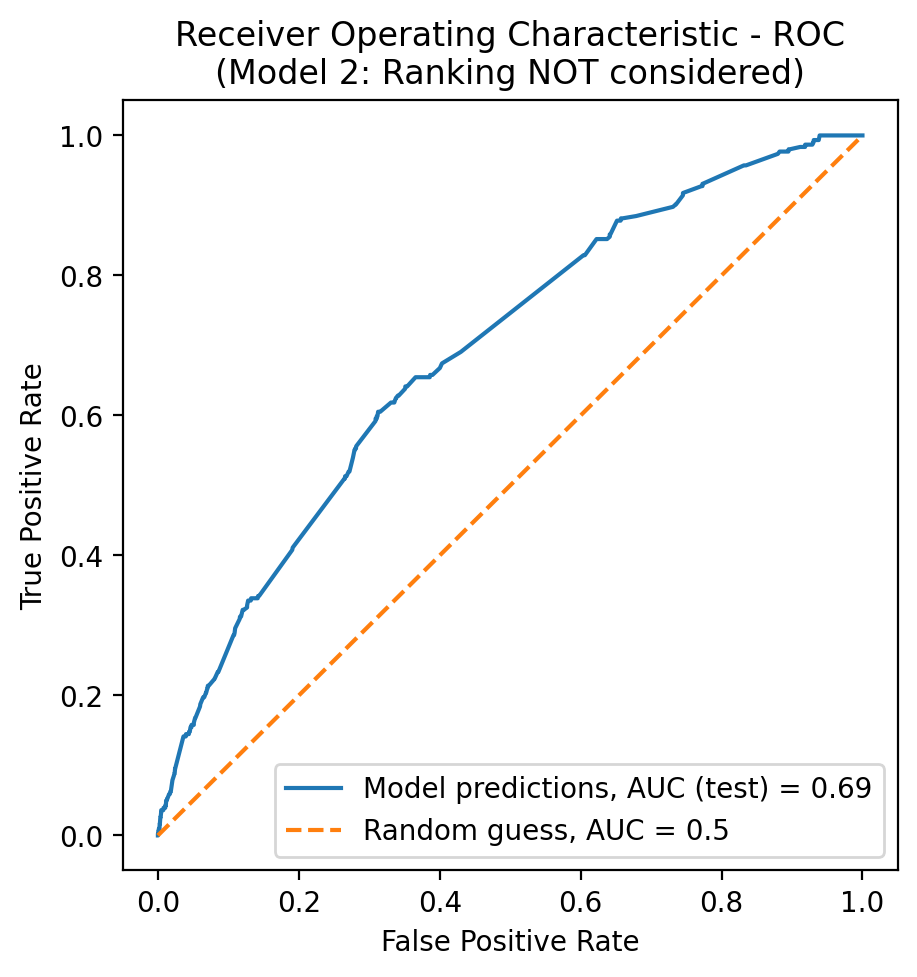
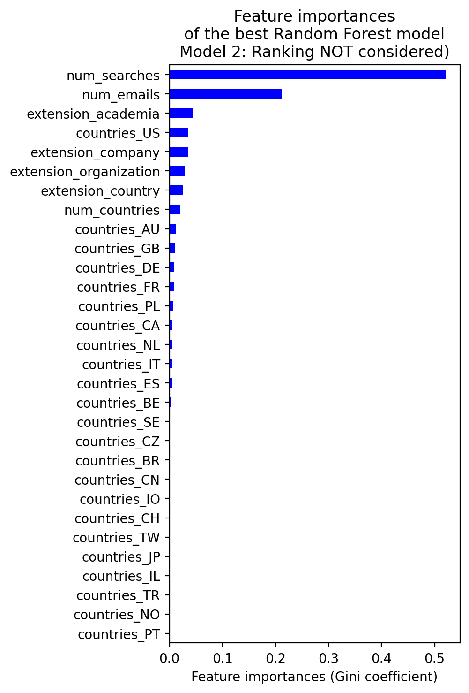

# Expert Chase Analysis

We are currently living the advent of the creator economy and the remote work, which was accelerated by the COVID-19 pandemic. I believe that that in the next decade (1) more companies will start looking for experts for project-based jobs and (2) more employed professionals will start consulting and freelancing as a side activity. Also, probably, the rigid 40-hour work week will disappear.

Companies like [Techspert](https://techspert.com) have embraced that change we are living and match companies and professionals. Yet finding proper experts that are willing to offer consultancy is still a challenge. This repository contains a related dataset and deals with one aspect around that challenge, summarized as follows:

> For each client project, suitable experts are searched, to whom an outreach email is sent. The order that the experts appeared in the search is recorded and whether each expert has responded (or not) to each outreach email.
>
> [The goal] is to **analyze and prepare this data and propose approaches or models that could be investigated to re-rank the profiles so that the top experts have the highest probability of responding positively.**

## Table of Contents

- [Expert Chase Analysis](#expert-chase-analysis)
  - [Table of Contents](#table-of-contents)
  - [Dataset](#dataset)
  - [How to Use This Project](#how-to-use-this-project)
    - [Installing Dependencies for Custom Environments](#installing-dependencies-for-custom-environments)
  - [Implemented Analysis and Modeling](#implemented-analysis-and-modeling)
    - [Assumptions](#assumptions)
    - [Summary of Findings and Results](#summary-of-findings-and-results)
  - [Next Steps and Possible Improvements](#next-steps-and-possible-improvements)
    - [Notes on Further Potential Models](#notes-on-further-potential-models)
  - [Authorship](#authorship)

## Dataset

The dataset [`data/data_Nov_2022.csv`](data/data_Nov_2022.csv) contains 371,804 entries of search results, each with the following seven columns/values:

> 1. `person-id`: a unique ID of a single person
> 2. `timestamp`: when the search was performed
> 3. `search-id`: a unique ID of a single search for a particular project
> 4. `search-ranking`: the rank of the person in the search result
> 5. `countries`: the domicile country-codes of the person
> 6. `email-domains`: the email domains of the person
> 7. `outreach-success`: "1" means that the outreach is successful, otherwise "0"

A straightforward approach would consist in treating `outreach-success` as the dependent variable and the rest as the independent variables. However, the goal is to improve the values of `search-ranking` based on the features of entries that have `outreach-success = 1`.

## How to Use This Project

The directory of the project consists of the following files:

```
.
├── LearningToRank_Challenge.docx             # Instructions
├── README.md                                 # This file (Markdown)
├── README.pdf                                # This file (PDF)
├── assets                                    # Results plots        
│   ├── feature_comparison_test.png
│   └── ...
├── conda.yaml                                # Environment dependencies
├── data                                      # Dataset (different versions)
│   ├── data_Nov_2022.csv                     # Original
│   ├── data_Nov_2022_preprocessed.csv        # Pre-processed
│   └── data_Nov_2022_reduced_experts.csv     # Pre-processed and reduced
├── expert_analysis.ipynb                     # Main notebook
├── requirements.txt                          # Additional dependencies (empty)
├── rf1.pickle                                # Model 1 serialized
├── rf2.pickle                                # Model 2 serialized
└── rf3.pickle                                # Model 3 serialized
```

At the present development stage, the complete implementation is in the Jupyter notebook [`expert_analysis.ipynb`](expert_analysis.ipynb). You can run the notebook in a custom environment, e.g., locally or in a container. For instance, to run it locally, you can create a [conda](https://docs.conda.io/en/latest/) environment and install the [dependencies](#installing-dependencies-for-custom-environments) as explained below. Then, you need to open the notebook, i.e.: 
 
```bash
jupyter lab . &
```

<!--
[](https://github.com/mxagar/expert_chase/blob/main/expert_analysis.ipynb)
:warning: The dataset is not available via Google Colab due to confidentiality reasons. Thus, if you want to open the notebook on Google Colab you need upload the dataset on your own.
-->

### Installing Dependencies for Custom Environments

If you'd like to control where the notebook runs, you need to create a custom environment and install the required dependencies. A quick recipe which sets everything up with [conda](https://docs.conda.io/en/latest/) is the following:

```bash
# Create environment with YAML, incl. pip packages
# Note 1: no versions are specified, because
# the project solution doesn't require any at this stage.
# The package manager resolves any version inconsistencies.
# Note 2: the selected packages are basic for many Data Science
# problems, the YAML file could be further pruned for the task.
conda env create -f conda.yaml
conda activate expert-env

# Optional: Install any pip packages you add later on
# Currently, requirements.txt is empty, because I moved
# all packages to conda.yaml 
pip install requirements.txt
```

List of most important dependencies:

- Pandas
- Scikit-Learn
- Scipy
- Matplotlib
- Seaborn

## Implemented Analysis and Modeling
<!-- A description of interesting parts of your solution and potential improvements or further work -->

The notebook is structured in 4 sections

1. **Dataset: Load and First Exposure**
2. **Data Preprocessing, Cleaning and Basic Feature Engineering**
3. **More Exploratory Data Analysis and Hypothesis Testing**
4. **Modeling: First Approach**

### Assumptions
<!-- A list of assumption you made and justification of your design decisions -->


### Summary of Findings and Results
<!-- A summary of any findings when preparing the data -->

<p align="center">
  
</p>

<p align="center">
  
</p>

<p align="center">
  
</p>

<p align="center">
  
</p>


## Next Steps and Possible Improvements

- [ ] A
- [ ] B

### Notes on Further Potential Models
<!-- Brief notes on potential models that could be trained on this data -->


<!--
## References, Interesting Links

- Link
- Link
-->

## Authorship

Mikel Sagardia, 2022.  
No guarantees.

<!--
If you find this repository useful, you're free to use it, but please link back to the original source.
-->